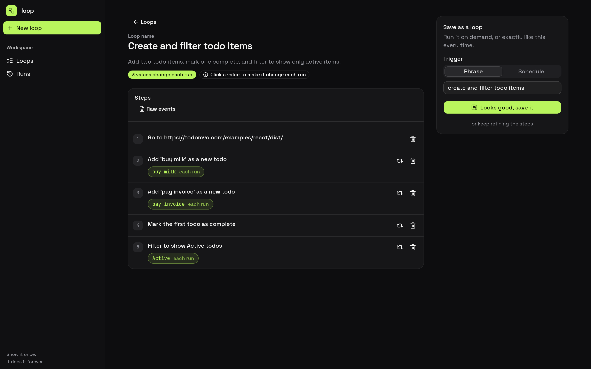

# loop

**Show it once. It does it forever.**

loop records a browser task once — by doing it in a cloud browser, or by describing it to an
agent — and turns it into an editable, plain-language step list that replays on demand in a
fresh [Steel](https://steel.dev) session.



## How it works

1. **Capture.** Drive a cloud browser yourself, or give the agent a goal. Every click, keystroke,
   and optional voice note is recorded.
2. **Review.** loop compiles the raw events into numbered steps you can edit, and marks the values
   that change each run as parameters.
3. **Run.** Replay the steps in a fresh, already-signed-in session and watch it work live.

## Features

- Record it yourself, or describe the goal and let the agent do it
- Editable steps with parameter pills — *changes each time* vs *always the same*
- Self-healing replay: ARIA re-resolution, then a vision click for canvas/visual-only targets
- Multi-item loops — "download each invoice"
- Voice narration, transcribed during recording to guide the steps
- Cloud sessions, managed proxies, and captcha solving via Steel
- Saved logins, downloads captured to the run, and guardrailed agents

## Quick start

```sh
nix develop
npm install
cp .env.example .env   # set STEEL_KEY and CLAUDE_KEY
npm run dev            # http://localhost:3000
```

`CLAUDE_KEY` powers the compiler and agent. Speech and proxy keys are optional; without them loop
still records and replays, just without narration or managed routing.

## Development

```sh
npm test            # unit tests (compiler, healing, narration, vision)
npm run typecheck   # tsc --noEmit
npm run build       # next build
npm run test:e2e    # browser end-to-end, with screenshots
```

## Documentation

See [ARCHITECTURE.md](./ARCHITECTURE.md) for how the pieces fit together.
